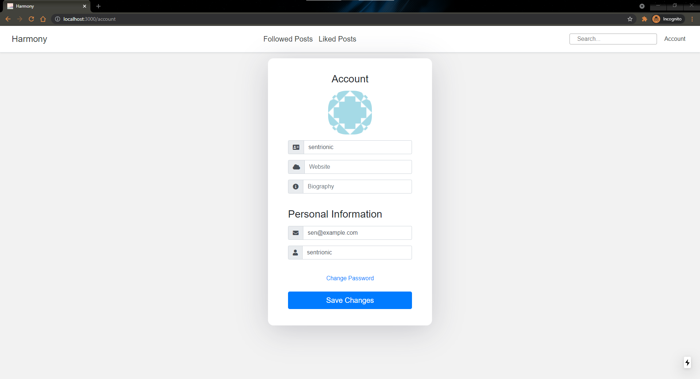

# Harmony

Harmony is an [Instagram](https://www.instagram.com/) like website using NestJS and NextJS.

## Screenshots

<table><tr>
  <tr>
    <td></td>
    <td></td>
    </tr>
    <tr>
    <td></td>
    <td></td>
  </tr>
  </table>

## Features

- Story CRUD
- Following System
- Search by username or hashtags
- Like system

## Stack

- [NestJS](https://nestjs.com/) for the GraphQL server
- [TypeORM](https://typeorm.io/#/) as the database ORM
- PostgreSQL
- Redis
- S3 for storing files
- [NextJS](https://nextjs.org/) to build the frontend
- [Apollo](https://www.apollographql.com/) to make requests and cache the results

## Installation

0. Install Node 12 (file upload does not work on newer versions)
1. Clone this repository
2. Install Postgres and Redis.
3. Run `yarn` to install all the dependencies
4. Rename `.env.example` to `.env`
   and fill out the values. AWS is only required if you want file upload,
   GMail if you want to send reset emails.
5. Run `yarn start:dev`.
6. Go to `localhost:4000/graphql` to view all queries and mutations.

## Credits

- [Ben Awad](https://www.youtube.com/watch?v=I6ypD7qv3Z8): This project is based on his fullstack React GraphQL tutorial.
